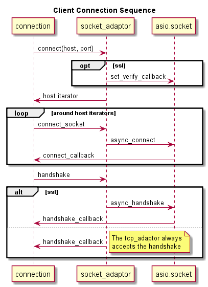
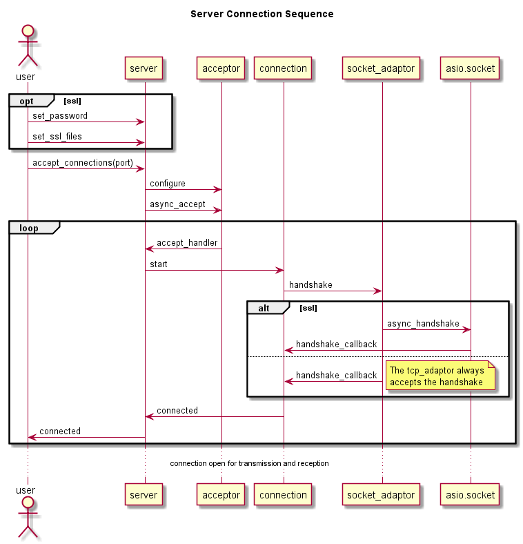

# The comms library `via::comms` #

# Requirements #

HTTP sessions are implemented over the Transmission Control Protocol (TCP/IP).
Secure HTTP sessions (HTTPS) are implemented using Secure Sockets Layer (SSL)
over TCP/IP.

Therefore HTTP servers and clients must implement TCP/IP communications and
HTTPS servers and clients must implement SSL communications.

# Design #

The `boost:asio` library contains excellent code for sending and receiving
messages on TCP, SSL, UDP and other communications protocols. However, the
library does not buffer received or transmitted messages. This is good for
efficiency but makes it hard to use...

The `via::comms` library simply uses a bridge design pattern to wrap the
boost::asio socket classes with buffers for the received and transmitted
messages.

The interface to the socket classes is provided by the connection class
template. It is instantiated with a `socket_adaptor` for the type of comms
socket required and a `container` for the type to use to buffer the data,
either `std::vector<char>` (the default) or `std::string`.

Similarly there is a server class template which is also instantiated with
a `socket_adaptor` and a `container`.

There are socket adaptors for TCP and SSL connections (`tcp_adaptor` and
`ssl_tcp_adaptor` respectively) to enable the creation of HTTP and HTTPS
connections and servers.

## Asio Callbacks and Object Lifetime ##

The `via::comms` library uses many `boost asio` asynchronous functions. The
`asio` asynchronous functions all require callback functions to be
registered which can then be called whenever the asynchronous function wishes
to return some data or signal an event.

It is vital that the callback functionsare either "static" functions or
if they're member functions, that the lifetime of the object that they
belong to is greater than the lifetime of the asynchronous function.
Otherwise the callback function could be called with a `this` pointer to
an object that no longer exists!

### Standard Pattern ###

A common pattern for ensuring that the lifetime of the object outlives
the callback function is to bind `shared_from_this` as the first parameter
to a member function, e.g.:

    void Connection::Receive()
    {
         boost::asio::async_read(socket_,boost::asio::buffer(this->read_buffer_),
            boost::bind(&Connection::handle_Receive, 
               shared_from_this(),
               boost::asio::placeholders::error,
               boost::asio::placeholders::bytes_transferred));
     }

This works because the call to boost::bind takes a copy of the shared_ptr to
the Connection (therefore increasing it's reference count) and so the
Connection can't be destroyed until async_read returns.

### Weak Pointer / Static Function Pattern ###

In order to enable the object to be destroyed using the RAII pattern the
shared_ptr must be replaced by a weak_ptr in the call to bind and the
read_callback function needs to be changed from a member function to a static
function which tests whether the weak pointer is still valid before trying 
to use it, e.g:

    void read_handler(boost::system::error_code const& error,
                      size_t bytes_transferred)
    {
      // process the read event as usual
    }

    /// Static callback function.
    /// It ensures that the object still exists and the event is valid
    /// before calling the read handler.
    static void read_callback(boost::weak_ptr<Connection> ptr,
                              boost::system::error_code const& error,
                              size_t bytes_transferred,
                              boost::shared_ptr<std::vector<char> > /* read_buffer */)
    {
      boost::shared_ptr<Connection> pointer(ptr.lock());
      if (pointer && (boost::asio::error::operation_aborted != error))
        pointer->read_handler(error, bytes_transferred);
    }
  
    /// Convert the shared_ptr to a weak_ptr in the call to bind
    void Connection::Receive()
    {
      boost::asio::async_read(socket_, boost::asio::buffer(read_buffer_),
            strand_.wrap(boost::bind(&Connection::read_callback,
                         boost::weak_ptr<Connection>(shared_from_this()),
                         boost::asio::placeholders::error,
                         boost::asio::placeholders::bytes_transferred,
                         read_buffer_)));
    }
    
Note: in this example the `read_buffer_` is stored in a `shared_ptr` and
passed in the `async_read` call of bind to ensure that the lifetime of the
`read_buffer_` exceeds the lifetime of `async_read`.

## Client Connections ##

Establishing an TCP/SSL client connection consists of three stages:

 1. Connect to the remote host and port.  
 The socket_adaptor resolves the host name to get a host_iterator.
 
 2. Connect to the host_iterator.
 If the host_iterator is valid, the connection attempts to connect to it. If
 unsuccessful it will iterate around the hosts until it connects or fails.
 
 3. If it connects to a host_iterator and it's an SSL socket, it initiates
 a handshake with the socket. If it's a TCP socket the socket adaptor will
 always accept the handshake.

## Server Connections ##

A TCP/SSL server consists of the following stages:

1. If it's an SSL server, set the password if required and the relevant SSL files.

2. When accept_connections is called, the server configures an acceptor to listen
on the required port and calls async_accept to start accepting connections.

3. When a client connects, the server's accept_handler is called which configures
the connection and starts the server handshake.

4. As with the client connection, if it's an SSL socket, it initiates
 a handshake with the socket. If it's a TCP socket the socket adaptor will
 always accept the handshake.

